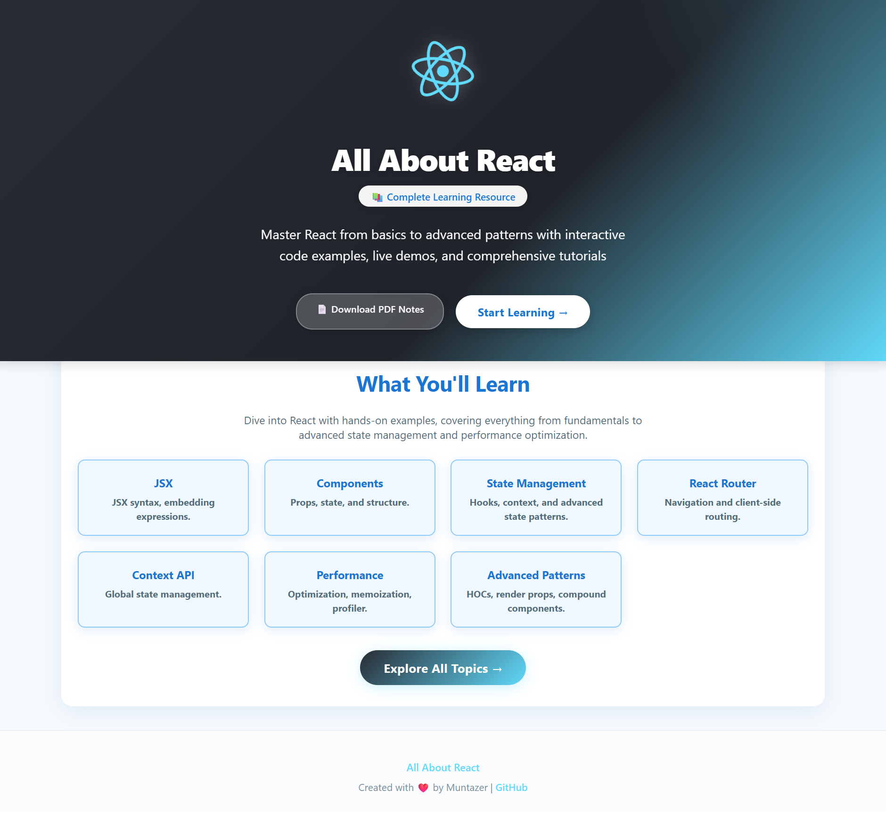
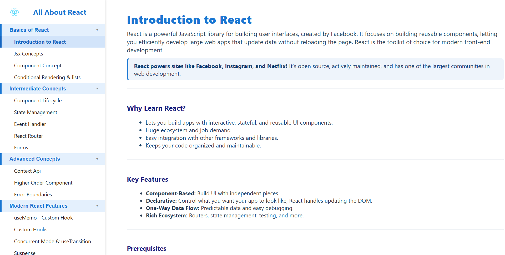
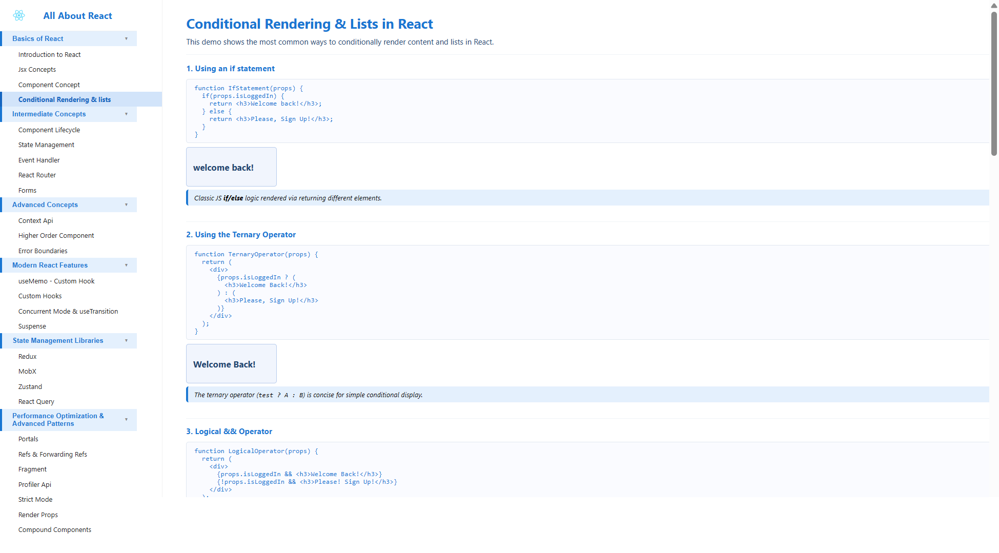

# 📚 All About React - Complete Learning Platform

A comprehensive, interactive React learning platform with **26+ topics** covering everything from basics to advanced patterns. Built with React and styled like professional documentation sites (W3Schools/MDN).


---

## 🌟 Features

- ✨ **26 Interactive Tutorials** - Each with code examples, live demos, and explanations
- 📝 **Copy-Paste Ready Code** - All examples are production-ready and lint-safe
- 🎨 **Professional UI** - W3Schools-inspired design with React blue theme
- 🔴 **Live Demos** - Every concept includes working, interactive examples
- 📱 **Fully Responsive** - Works beautifully on desktop, tablet, and mobile
- 🎯 **Beginner to Advanced** - Structured learning path from fundamentals to expert patterns
- 🚀 **Modern React** - Covers React 18+ features including Concurrent Mode
- 📖 **PDF Notes Included** - Downloadable reference guide

---

## 📸 Screenshots

### Landing Page

*Beautiful landing page with React's classic dark-to-cyan gradient featuring the hero section, topic cards, and professional layout*

### Sidebar Navigation & Introduction Page

*Clean, professional W3Schools-style sidebar with organized topic sections and comprehensive introduction page*

### Interactive Tutorial Pages

*Each tutorial includes code blocks, live output, and educational tips - perfect for hands-on learning*

---

## 📚 Topics Covered

### 🔰 Basics of React
- Introduction to React
- JSX Concepts
- Component Concept
- Conditional Rendering & Lists

### 📖 Intermediate Concepts
- Component Lifecycle
- State Management (useState, useReducer)
- Event Handling
- Forms (Controlled & Uncontrolled)
- React Router

### 🚀 Advanced Concepts
- Context API
- Higher Order Components (HOCs)
- Error Boundaries

### ⚡ Modern React Features
- useMemo & useCallback
- Custom Hooks
- Concurrent Mode & useTransition
- Suspense & Lazy Loading

### 🗄️ State Management Libraries
- Redux (Plain, Thunk, Toolkit)
- MobX
- Zustand
- React Query

### 🎯 Performance Optimization & Advanced Patterns
- Portals
- Refs & Forwarding Refs
- Fragment
- Profiler API
- Strict Mode
- Render Props
- Compound Components

---

## 🚀 Getting Started

### Prerequisites
- Node.js 14+ and npm
- Basic knowledge of HTML, CSS, and JavaScript (ES6+)

### Installation

1. **Clone the repository**
   ```bash
   git clone https://github.com/yourusername/All-About-React.git
   cd All-About-React
   ```

2. **Install dependencies**
   ```bash
   npm install
   ```

3. **Start the development server**
   ```bash
   npm start
   ```

4. **Open your browser**
   ```
   http://localhost:3000
   ```

---

## 🏗️ Project Structure

```
All-About-React/
├── public/
│   ├── All-About-React.pdf      # PDF notes
│   └── index.html
├── src/
│   ├── Components/
│   │   ├── intro/               # Introduction page
│   │   ├── Jsx/                 # JSX tutorial
│   │   ├── Component/           # Component concepts
│   │   ├── Rendering/           # Conditional rendering
│   │   ├── componentLifecycle/  # Lifecycle methods
│   │   ├── stateManagement/     # useState, useReducer
│   │   ├── EventHandling/       # Event handlers
│   │   ├── Forms/               # Form handling
│   │   ├── Router/              # React Router
│   │   ├── contextApi/          # Context API
│   │   ├── higherOrderComponent/# HOC pattern
│   │   ├── errorBoundaries/     # Error handling
│   │   ├── Hooks/               # useMemo, useCallback
│   │   ├── CustomHooks/         # Custom hooks tutorial
│   │   ├── ConcurrentMode/      # useTransition, Concurrent features
│   │   ├── Suspense/            # Suspense & lazy loading
│   │   ├── Redux/               # Redux tutorials
│   │   ├── MobX/                # MobX tutorial
│   │   ├── Zustand/             # Zustand tutorial
│   │   ├── reactQuery/          # React Query tutorial
│   │   ├── Portals/             # Portals tutorial
│   │   ├── Refs&ForwardingRefs/ # Refs tutorial
│   │   ├── Fragment/            # Fragment tutorial
│   │   ├── profilerApi/         # Profiler API tutorial
│   │   ├── StrictMode/          # Strict Mode tutorial
│   │   ├── RenderProp/          # Render Props pattern
│   │   ├── CompoundComponents/  # Compound Components pattern
│   │   ├── Header.js            # Sidebar navigation
│   │   ├── Home.js              # Landing page
│   │   └── SidebarLayout.js     # Layout wrapper
│   ├── App.js                   # Main app & routing
│   └── index.js                 # Entry point
└── package.json
```

---

## 🎨 Design Philosophy

This project follows modern documentation site principles:

- **W3Schools-inspired sidebar** - Clean, organized, easy navigation
- **React blue color theme** - Consistent with React branding (#1976d2)
- **Left-aligned content** - Professional, readable layout
- **Code + Output pattern** - Every tutorial shows code AND live demo
- **Educational tips** - Callouts, info boxes, and best practices
- **Copy-paste friendly** - All code examples are ready to use

---

## 🛠️ Tech Stack

- **React 18+** - Latest React features including Concurrent Mode
- **React Router** - Client-side routing
- **Redux / Redux Toolkit** - State management examples
- **MobX** - Observable state management
- **Zustand** - Lightweight state management
- **React Query** - Server state management
- **react-window** - Virtualized lists for performance
- **react-icons** - Icon library (if needed)

---

## 📖 How to Use This Project

### For Learning
1. Start with the **Introduction to React** page
2. Follow the sidebar sections from top to bottom
3. Read the explanations and code examples
4. Interact with the live demos
5. Copy code examples to experiment in your own projects

### For Teaching
- Use as a reference for teaching React
- Share specific topic URLs with students
- Use code examples in presentations
- Demonstrate live in classroom settings

### For Reference
- Quick lookup for React patterns
- Code snippet reference
- Best practices guide
- Performance optimization techniques

---

## 🎯 Learning Path Recommendation

**Beginner Path:**
1. Introduction → JSX → Components → Rendering → Lifecycle → State → Events → Forms

**Intermediate Path:**
2. React Router → Context API → Error Boundaries → Custom Hooks

**Advanced Path:**
3. HOCs → Render Props → Compound Components → useMemo → Concurrent Mode → Suspense

**State Management:**
4. Redux → MobX → Zustand → React Query

**Performance & Patterns:**
5. Profiler API → Strict Mode → Portals → Refs → Fragment

---

## 🤝 Contributing

Contributions are welcome! If you'd like to add more topics, improve existing tutorials, or fix bugs:

1. Fork the repository
2. Create a feature branch (`git checkout -b feature/NewTopic`)
3. Commit your changes (`git commit -m 'Add new topic: XYZ'`)
4. Push to the branch (`git push origin feature/NewTopic`)
5. Open a Pull Request

---

## 📝 License

This project is licensed under the MIT License - see the [LICENSE](LICENSE) file for details.

---

## 👨‍💻 Author

**Muntazer**
- GitHub: [@muntazer](https://github.com/muntazer)

---

## 🙏 Acknowledgments

- React team for creating an amazing library
- The React community for excellent documentation and resources
- W3Schools and MDN for design inspiration
- All open-source contributors

---

## 📬 Feedback

Found a bug? Have suggestions? Want to add a topic?
- Open an issue on GitHub
- Submit a pull request
- Contact via GitHub

---

## 🔮 Future Enhancements

Potential additions (not yet implemented):
- Testing tutorials (Jest, React Testing Library)
- TypeScript with React
- Server-Side Rendering (Next.js basics)
- Animation libraries (Framer Motion)
- Form validation libraries (Formik, React Hook Form)
- Accessibility best practices
- CSS-in-JS patterns
- React Native basics

---

**Happy Learning! 🚀**

Built with ❤️ and React
